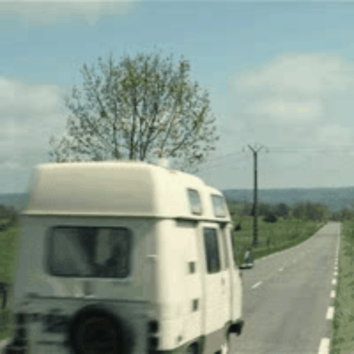
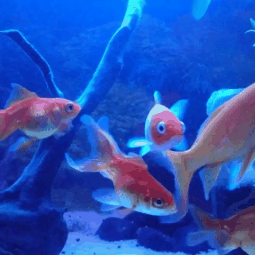

<div align="center">

<h1>Swin-Editor: A Comprehensive Framework for Text-Driven Video Editing</h1>

<br>
<image src="docs/Overview (4)-1.png" />
<br>

</div>

Large visual models have recently made considerable progress in Text-to-Video generation thanks to the development of foundation models and multi-modal alignment techniques, making video generation more and more realistic. Current approaches predominantly rely on adapting image-based diffusion models via spatio-temporal attention, but this generally leads to temporal inconsistency and increasing model complexity. This inconsistency is mainly related to the fact those approaches are founded on models that were originally designed for image generation, thus, they do not consider implicitly the spatio-temporal aspect
of videos. In this article, we introduce Swin-Editor, an efficient approach of video editing from text-instruction that expands a diffusion-based Text-to-Image model into Text-to-Video. Specifically, our focus lies in enhancing the visual quality of the generated videos by incorporating a spatio-temporally factorized video prediction mechanism in the diffusion model. Additionally, to reduce computational complexity and memory requirements, the proposed model includes a Vector Quantized Variational Autoencoders module, intended to quantize and compress the spatio-temporal latent features. The proposed architecture produces a good compromise between multiple evaluation metrics against state-of-the-art models in various scenarios.

## Installation
### Requirements

```shell
pip install -r requirements.txt
```
Installing [xformers](https://github.com/facebookresearch/xformers) is highly recommended for improved efficiency and speed on GPUs. 

## Run Demo

```bash
accelerate launch test_swineditor.py --config path/to/config
```

## Examples
<table class="center">
<tr>
  <td style="text-align:center;color:gray;"><b>Input Video</b></td>
  <td style="text-align:center;"><b>Output Video</b></td>
  <td style="text-align:center;color:gray;"><b>Input Video</b></td>
  <td style="text-align:center;"><b>Output Video</b></td>
</tr>
<tr>
  <td width=25% style="text-align:center;">"A cat in the grass in the sun"</td>
  <td width=25% style="text-align:center;">"A dog in the grass in the sun"</td>
  <td width=25% style="text-align:center;">"A cat in the grass in the sun"</td>
  <td width=25% style="text-align:center;">"A red lion in the grass in the sun, surrounded by butterflies"</td>
</tr>
<tr>
  <td></td>
  <td></td>
  <td></td>
  <td></td>
</tr>
<tr>
  <td width=25% style="text-align:center;color:gray;">"A car is driving on the road"</td>
  <td width=25% style="text-align:center;">"a train is driving on the railway"</td>
  <td width=25% style="text-align:center;color:gray;">"A car is driving on the road"</td>
  <td width=25% style="text-align:center;">"A truck is driving on the road"</td>
</tr>
<tr>
  <td></td>
  <td></td>
  <td></td>
  <td></td> 
</tr>
<tr>
  <td width=25% style="text-align:center;color:gray;">"Several goldfish swin in a tank"</td>
  <td width=25% style="text-align:center;">"Several sharks swim in a tank"</td>
  <td width=25% style="text-align:center;color:gray;">"Two grey sharks swin in the blue ocean on a coral reef"</td>
  <td width=25% style="text-align:center;">"Two quadrotor drones swim in the blue ocean on a coral reef"</td>
</tr>
<tr>
  <td></td>
  <td></td>
  <td></td>
  <td></td>
</tr>
<tr>
  <td width=25% style="text-align:center;color:gray;">"A jeep car is moving on the road"</td>
  <td width=25% style="text-align:center;">"A jeep car is moving on the snow"</td>
  <td width=25% style="text-align:center;color:gray;">"A jeep car is moving on the road"</td>
  <td width=25% style="text-align:center;">"a jeep car is moving on the road, cartoon style"</td>
</tr>
<tr>
  <td></td>
  <td></td> 
  <td></td>
  <td></td> 
</tr>
</table>

## citation

If you make use of our work, please cite our paper.

```
@article{swin-editor,
  title={Swin-Editor: A Comprehensive Framework for Text-Driven Video Editing},
  author={Author1, Author2, Author3},
  journal={WACV 2025},
  year={2024}
}
```
